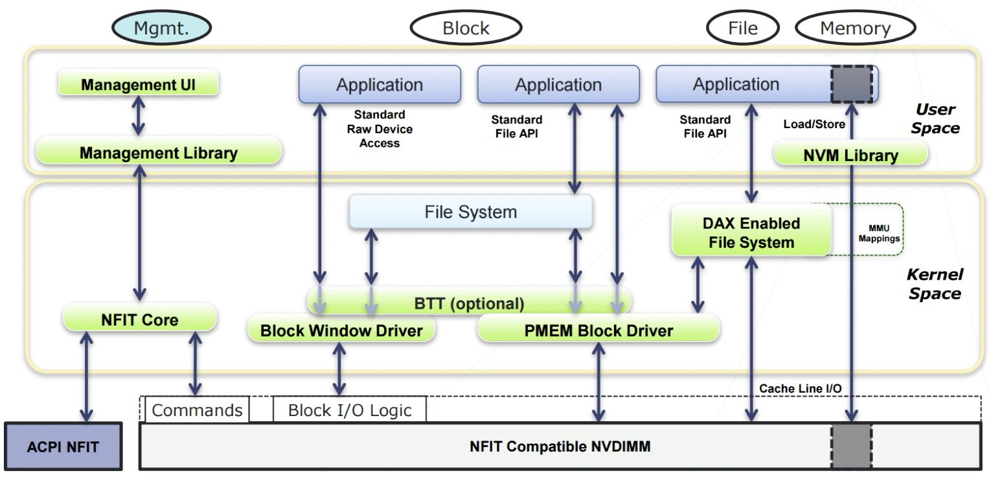

### 傲腾持久化内存(Aep)工作模式

1. Memory Mode：在这种模式下，DRAM+AEP一起呈现为大容量内存，总容量为AEP的容量，DRAM被用作cache，对系统不可见，注意这种模式下内存是非持久性的，即断电后内容就丢失。 
2. App Direct模式：在这种模式下，AEP呈现为pmem持久性内存设备（/dev/pmem），系统看到的内存是DRAM，应用通过操作pmem设备来读写AEP。目前主流的文件系统ext4, xfs 都支持Direct Access的选项（-o dax),  当挂载完成后并且映射完地址空间后，读写就通过Load/Store的内存指令来进行，绕过了传统的文件系统或者块设备访问路径。




### 持久化内存编程

AEP PMEM设备映射到地址空间后，读写通过内存load/store进行，对于store命令，实际上数据并不会马上写到PMEM，而是会先在CPU cache里，然后刷回到内存，即使已经刷回到内存了，实际上也可能在内存控制器的请求队列(WPQ)里。因此应用程序如果要确保数据已经持久化（即保证落盘），需要有额外的处理。  

CLFLUSH: 能够把指定缓存行（Cache Line）从所有级缓存中淘汰，若该缓存行中的数据被修改过，则将该数据写入主存；支持现状：目前主流处理器均支持该指令。  
CLFLUSHOPT：作用与 CLFLUSH 相似但其之间的指令级并行度更高，比如在访问不同 CacheLine 时，CLFLUHOPT 可以乱序执.   
CLWB：将指定的cache line刷回内存（如果是脏数据的话）  
NTSTORE(non-temporal store): 在传输数据时能够绕过缓存，而直接将数据写入主存   
FENCE：内存屏障（Memory Barrier），起着约束其前后访存指令之间相对顺序的作用。  


### 编程示例

"/mnt/pmem"是使用dax模式mout挂载持久化内存之后对应的文件目录，在下面创建一个名为pmem-file文件。通过mmap来映射地址空间，之后的读写就替换原来的I/O路径，而使用load/store进行。具体的例子参考如下：
```c
#include <stdio.h>
#include <stdlib.h>
#include <unistd.h>
#include <sys/mman.h>
#include <string.h>
#include <fcntl.h>

#define PATH "/mnt/pmem/pmem-file"
#define SIZE 4096

int main() {
  //open the pmem file
  int fd = open(PATH, O_RDWR);
  if (fd < 0) {
    perror("failed to open the file");
    exit(1);
  }

  //mmap the pmem file
  void *addr = mmap(NULL, SIZE, PROT_READ | PROT_WRITE, MAP_SHARED, fd, 0);
  if (addr == MAP_FAILED) {
    perror("failed to mmap the file");
    exit(1);
  }

  //we now hava the memory region start from "addr" with the offset "size"

  //use parts of the memory region as a buf
  char *pmem_buf = addr + (1 << 5);
  strcpy(pmem_buf, "hello,  persistent memory");
  printf("pmem_str: %s", pmem_buf);

  if (munmap(addr, SIZE) != 0) {
    perror("failed to unmap the file");
    exit(1);
  }
  close(fd);
  return 0;
}
```


前面提到对于内存的store指令，数据并不会马上写到PMEM，需要有额外的指令保证持久化的特性，Intel提供了一个轻量级的库libpmem， https://pmem.io/pmdk/manpages/linux/master/libpmem/libpmem.7.html

```c
#include <sys/types.h>
#include <sys/stat.h>
#include <fcntl.h>
#include <stdio.h>
#include <errno.h>
#include <stdlib.h>
#include <unistd.h>
#include <string.h>
#include <libpmem.h>

/* using 4k of pmem for this example */
#define PMEM_LEN 4096

#define PATH "/mnt/pmem/pmem-file"

  int
main(int argc, char *argv[])
{
  char *pmemaddr;
  size_t mapped_len;
  int is_pmem;

  /* create a pmem file and memory map it */

  if ((pmemaddr = pmem_map_file(PATH, PMEM_LEN, PMEM_FILE_CREATE,
          0666, &mapped_len, &is_pmem)) == NULL) {
    perror("pmem_map_file");
    exit(1);
  }

  /* store a string to the persistent memory */
  strcpy(pmemaddr, "hello, persistent memory");
  printf("pmem_str: %s", pmemaddr);

  /* flush above strcpy to persistence */
  if (is_pmem)
    pmem_persist(pmemaddr, mapped_len);
  else
    pmem_msync(pmemaddr, mapped_len);

  /*
   * Delete the mappings. The region is also
   * automatically unmapped when the process is
   * terminated.
   * */
  pmem_unmap(pmemaddr, mapped_len);
}
```

从上面代码看到封装了mmap的操作，同时 pmem_persist封装了clwb，sfence等持久化操作。
